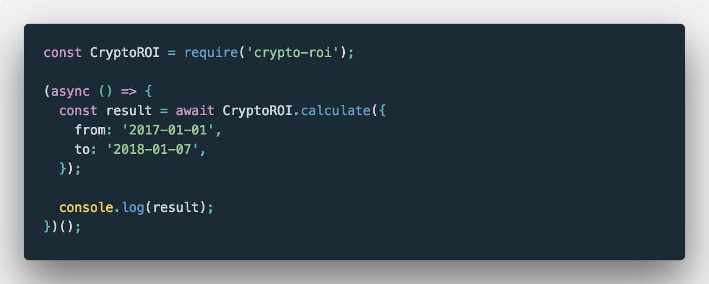
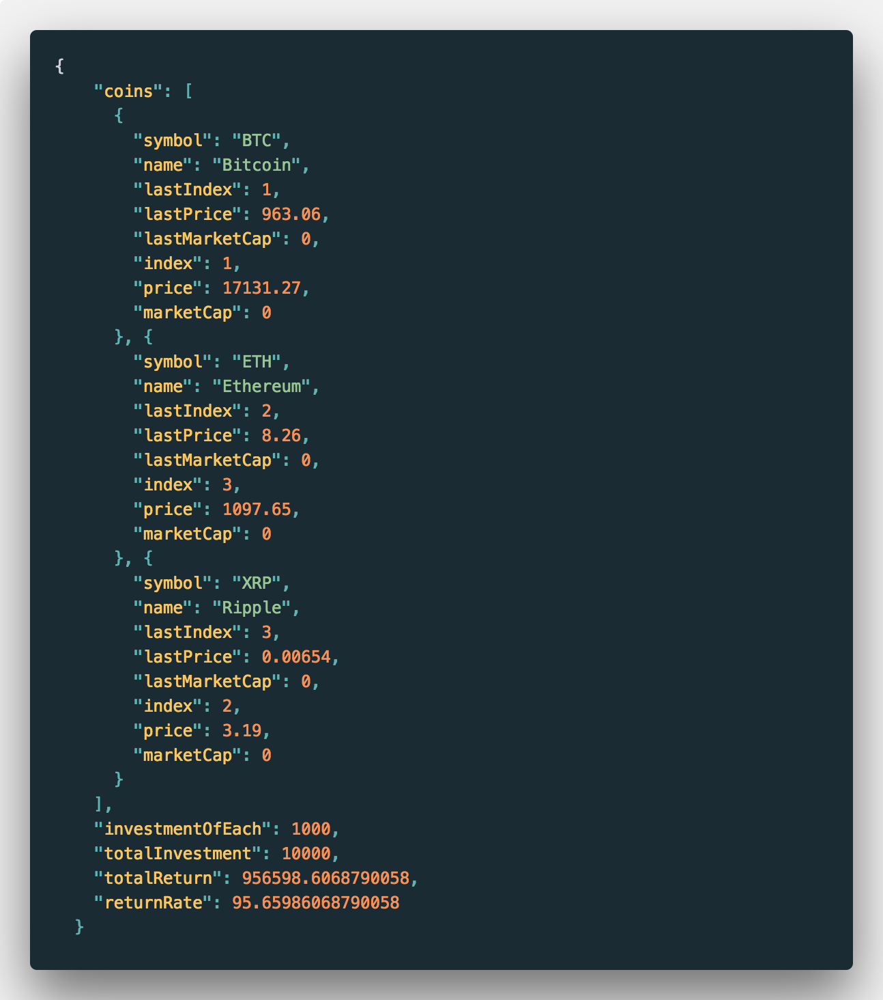

# crypto-roi
A ROI calculator of holding top coins on coinmarketcap.com

[]()
[](https://travis-ci.org/phatpham9/crypto-roi)
[](https://github.com/phatpham9/crypto-roi)
[](https://github.com/phatpham9/crypto-roi)
[](https://www.npmjs.com/package/crypto-roi)
[](https://www.npmjs.com/package/crypto-roi)

## Usage

### Install

Make sure you have NodeJS >= 9, yarn (most prefered) or npm installed. Then install the library to your project:

```bash
yarn add crypto-roi
```

### Example

<div style="text-align: center;">
  
</div>

The result will look like this:

<div style="text-align: center;">
  
</div>

## Author & Contributors

- Phat Pham | Author | [Website](https://onroads.xyz) | [GitHub](https://github.com/phatpham9)
- Khang Huynh | [GitHub](https://github.com/khanghuynh92)
