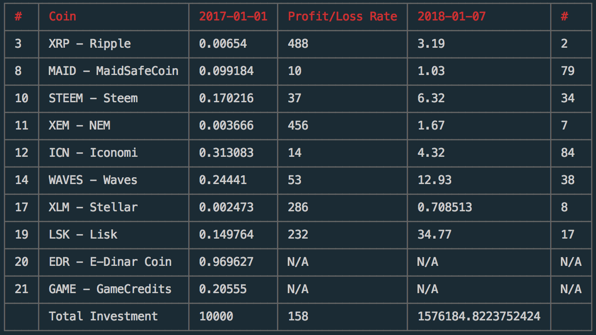

# cryptocurrency-roi
A ROI calculator of top cryptocurrencies on coinmarketcap.com

[]()
[](https://travis-ci.org/phatpham9/cryptocurrency-roi)
[](https://github.com/phatpham9/cryptocurrency-roi)
[](https://github.com/phatpham9/cryptocurrency-roi)
[](https://www.npmjs.com/package/phatpham9/cryptocurrency-roi)
[](https://www.npmjs.com/package/phatpham9/cryptocurrency-roi)

## Getting Started

### Installation
Make sure you have NodeJS >= 9, yarn (most prefered) or npm installed. Then install the tool:

```bash
yarn global add cryptocurrency-roi
```

### Usage

I want to calculate the ROI of `top 10` on CoinMarketCap `from 2017-01-01 to 2018-01-07` that have `price is less than 1$` and `excluded USDT & DOGE`:

```bash
roi 10 -f 2017-01-01 -t 2018-01-07 --max 1 -i USDT,DOGE
```

The result will be like this:

<div style="text-align: center;">
  
</div>

## Author & Contributors

- Phat Pham | Author | [Website](https://onroads.xyz) | [GitHub](https://github.com/phatpham9)
- Khang Huynh | [GitHub](https://github.com/khanghuynh92)
